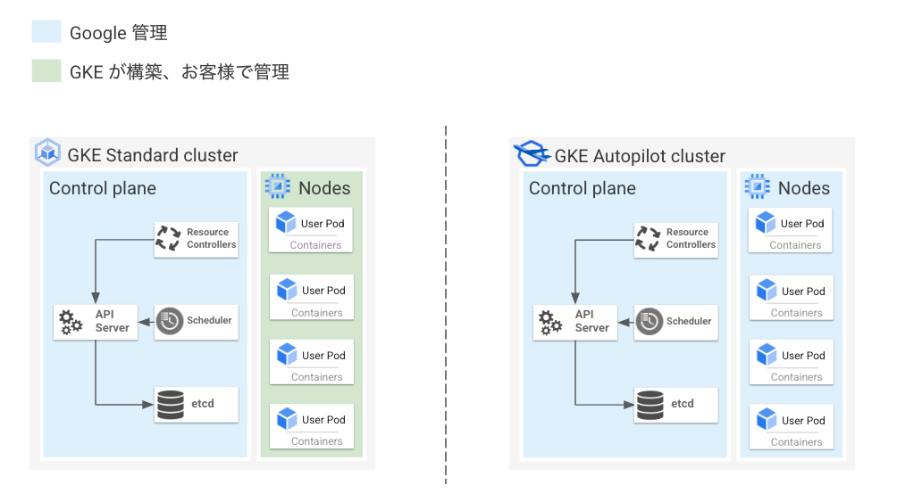
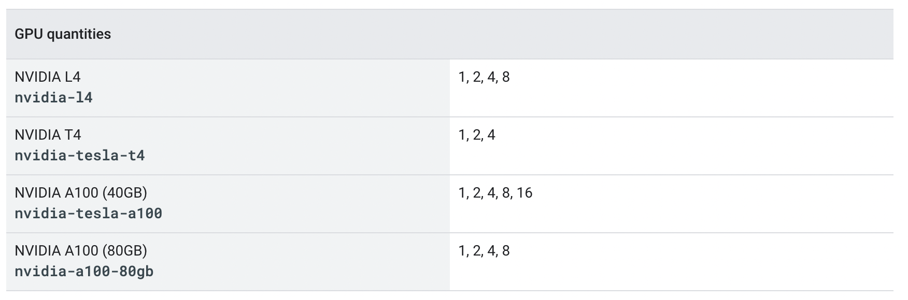
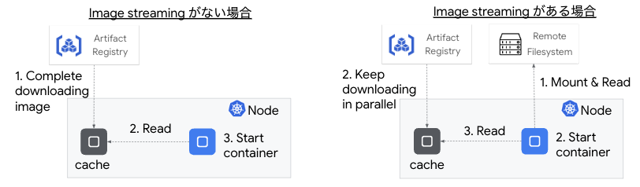
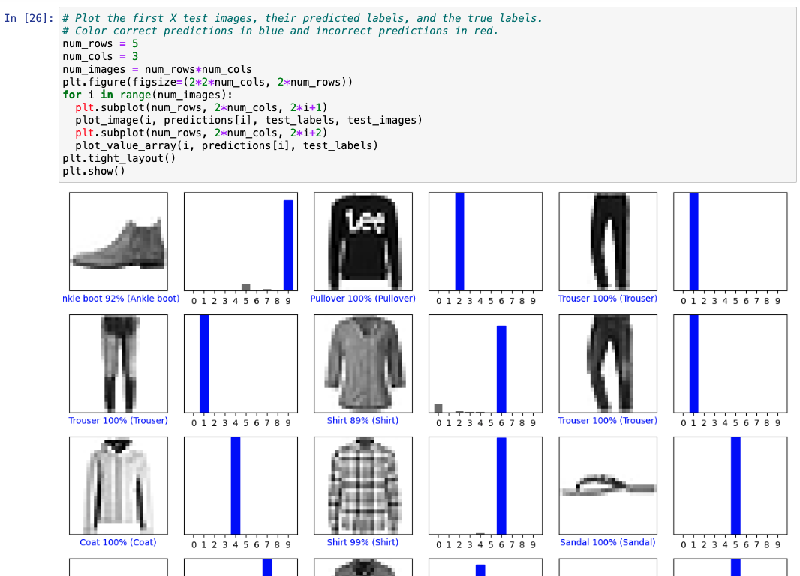
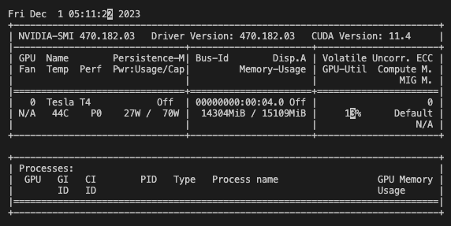

この記事は [Google Cloud Japan Advent Calendar 2023 (入門編)](https://zenn.dev/google_cloud_jp/articles/65eb509ce7dc91) の 2 日目の記事です。  

「Kubernetes で GPU を使う」と聞くと結構ハードルが高く感じる方もいらっしゃるのではないでしょうか。本記事では GKE (特に GKE Autopilot) が GPU ワークロードの実行基盤として良いよという話をします。  

# tl;dr
* GKE で GPU 使うのめっちゃ簡単
* クラスタを構築して `nodeSelector` 等で GPU Node を指定をしたマニフェストを適用するだけ (GPU デバイスドライバのインストールや管理も不要)

# Google Kubernetes Engine (GKE)　とは
Google Kubernetes Engine（以降 GKE）は Google Cloud が提供するフルマネージドな Kubernetes プラットフォームです。  
自動スケールや自動アップグレードなど、Kubernetes をより簡単かつ安全に使うための機能を多く提供しています。GKE の良さについて以下の記事でも紹介をしているので、ご興味ある方は読んでみてください。  
https://gihyo.jp/article/2023/09/modern-app-development-on-google-cloud-02

## GKE Standard と GKE Autopilot
GKE はクラスタという単位で管理され、1 つの GKE クラスタは Control Plane と Node という 2 種類のコンポーネントから構成されます。  

Kubernetes API のエンドポイントを提供する kube-api server や Kubernetes オブジェクトの構成情報を保管する etcd などシステム関連コンポーネントが動いているマシンを Control Plane と呼びます。  
一方、実際のコンテナアプリケーションが動いているマシンを Node と呼びます。Node は Node Pool という単位でグルーピングされ管理されます。  

GKE では Control Plane は Google が管理しており、ユーザー側で Control Plane の運用（アップグレードやセキュリティ対策、スケール等）をする必要はありません。  
一方 Node についてはユーザー管理と Google 管理の 2 つのモードから選ぶことができます。Node をユーザー側で管理するクラスタを **GKE Standard**、Google で管理するクラスタ **GKE Autopilot** と呼びます。  


## GKE Autopilot の特徴
先述の通り、GKE Autopilot は Control Plane だけでなく Node も Google 管理になっています。  
具体的には Node のサイズや台数調整などリソース管理の自動化や Node のアップグレード作業の自動化をしてくれることで管理負荷の低減を実現しています。  

GKE Autopilot は Node が管理不要なモデルになっているものの、何かしら特殊なアーキテクチャで構成されているわけではありません。通常の GKE クラスタをベースにしつつ各種自動化機能を活用することにより実現しています。  
したがって、Job や DaemonSet など Kubernetes の基本リソースをデプロイできますし、Istio や ArgoCD など多くの Kubernetes のエコシステムの実行もサポートしています。(後述するセキュリティ要件を満たしている必要があります)  

また、GKE Autopilot は GKE を利用するうえでのおすすめ設定（いわゆるベストプラクティス）が組み込みで実装されており、プロダクションレディなクラスタをすぐに利用できます。セキュリティ観点では Node へ SSH できなかったり、特権コンテナのデプロイ不可、利用可能な Linux capabilities が制限されているというような特徴もあります。  

以上より、GKE Autopilot は Kubernetes / GKE の良いところをそのまま残しつつ**運用負荷の低減**、**各種プラクティスの適用**、**セキュリティの向上**を実現しており、**アプリケーション開発に集中できる Kubernetes クラスタ**といえます。  

# GKE Autopilot で GPU を使う
ここからが本題です。GKE Autopilot で GPU を使ってみましょう。  

## GKE Autpilot は何をしてくれるのか？
GKE Autopilot で GPU を利用したい場合、何をしたら良いのでしょうか。答えとしては **GPU を要求する Pod を作成するだけ**です。簡単ですね。  
以下のようにマニフェストで GPU のラベルを持つ Node を選択するだけで、あとは GKE の [Node Auto-Provisioning (NAP)](https://cloud.google.com/kubernetes-engine/docs/concepts/node-auto-provisioning) という機能により、GPU Node がプロビジョニングされます。  
プロビジョニングされた GPU Node には GPU デバイスドライバが自動的にインストールされており、利用者側での管理も不要です。  
また `spec.containers[].resources.limits` で利用する GPU の数を制御します。以下は NVIDIA T4 GPU を 1 枚使う例です。
```yaml:gpu-pod.yaml
apiVersion: v1
kind: Pod
metadata:
  name: my-gpu-pod
spec:
  nodeSelector:
    cloud.google.com/gke-accelerator: nvidia-tesla-t4
  containers:
  - name: my-gpu-container
    image: nvidia/cuda:11.0.3-runtime-ubuntu20.04
    command: ["/bin/bash", "-c", "--"]
    args: ["while true; do sleep 600; done;"]
    resources:
      limits:
        nvidia.com/gpu: 1
```

## GKE Autopilot がサポートしている GPU の種類
GKE Autopilot では 2023.12 現在、`NVIDIA L4`, `NVIDIA T4`, `NVIDIA A100 (40 or 80GB)` の GPU をサポートしています。また、GPU は 1 枚から利用可能なので、スモールスタートが非常にしやすくなっています。  


さらに、以下のように `cloud.google.com/gke-spot: "true"` というラベルを持つ Node を要求することにより、[Spot VMs](https://cloud.google.com/kubernetes-engine/docs/concepts/spot-vms) という標準的な VM に比べて安価な VM を利用しコストを圧縮することも可能です。
```yaml
spec:
  nodeSelector:
    cloud.google.com/gke-accelerator: nvidia-tesla-t4
    cloud.google.com/gke-spot: "true"
```

## Image Streaming によるイメージ Pull の高速化
ちなみに GKE Autpilot では [Image Streaming](https://cloud.google.com/kubernetes-engine/docs/how-to/image-streaming?hl=ja) という機能がデフォルトで有効になっています (1.25.5-gke.1000 以降)。  
これはコンテナイメージのデータをストリーミングしイメージの Pull を高速化させる機能で、コンテナイメージ全体を Node に落とさずに Pod を立ち上げることが可能となるため、ML ワークロードなどサイズの大きいコンテナイメージの Pull 時間の短縮や NAP により Node が新しくプロビジョニングされた場合のスピンアップを高速にすることができるようになります。(Artifact Registry に格納されているコンテナイメージが対象となります)  


## 実際に試してみる

### GKE Autopilot クラスタのデプロイ
まず、以下コマンドを実行し Autopilot クラスタをデプロイします。少し時間がかかるのでゆっくり待ちます。  
```bash
# 環境変数の設定
export PROJECT_ID=<YOUR PROJECT ID>
export CLUSTER_NAME=gpu-cluster
export REGION=asia-northeast1

# Project ID の設定
gcloud config set project ${PROJECT_ID}

# GKE Autopilot クラスタの作成
gcloud container clusters create-auto ${CLUSTER_NAME} \
    --location=${REGION}
```

### GPU を使う Pod をデプロイする
クラスタが作成できたら、GPU を要求する Pod をデプロイします。今回は以下の Tensorflow 対応の Jupyter notebook をデプロイします。
```yaml:tensorflow.yaml
apiVersion: apps/v1
kind: StatefulSet
metadata:
  name: tensorflow
spec:
  selector:
    matchLabels:
      pod: tensorflow-pod
  serviceName: tensorflow
  replicas: 1
  template:
    metadata:
      labels:
        pod: tensorflow-pod
    spec:
      nodeSelector:
        cloud.google.com/gke-accelerator: nvidia-tesla-t4
        cloud.google.com/gke-spot: "true"
      terminationGracePeriodSeconds: 30
      containers:
      - name: tensorflow-container
        image: tensorflow/tensorflow:latest-gpu-jupyter
        volumeMounts:
        - name: tensorflow-pvc
          mountPath: /tf/saved
        resources:
            requests:
              nvidia.com/gpu: "1"
              ephemeral-storage: 10Gi
## Optional: override and set your own token
#        env:
#          - name: JUPYTER_TOKEN
#            value: "jupyter"
  volumeClaimTemplates:
  - metadata:
      name: tensorflow-pvc
    spec:
      accessModes:
        - ReadWriteOnce
      resources:
        requests:
          storage: 100Gi
```

ではデプロイしてみます。仕組み上、Node Auto-Provisioning によるノードのプロビジョニングが最初に実行されるため、Pod のデプロイ完了まで少し時間がかかります。  
```bash
$ kubectl apply -f https://raw.githubusercontent.com/WilliamDenniss/autopilot-examples/main/tensorflow/tensorflow.yaml
$ kubectl apply -f https://raw.githubusercontent.com/WilliamDenniss/autopilot-examples/main/tensorflow/tensorflow-jupyter.yaml

$ kubectl get pods
NAME           READY   STATUS    RESTARTS   AGE
tensorflow-0   1/1     Running   0          11m

$ kubectl get svc
NAME                         TYPE           CLUSTER-IP       EXTERNAL-IP   PORT(S)        AGE
tensorflow                   ClusterIP      None             <none>        8888/TCP       36m
tensorflow-jupyter           LoadBalancer   34.118.230.11    xx.xx.xx.xx   80:32579/TCP   36m
```

Pod が作成できました。実際にアクセスしてチュートリアルを動かしてみます。  


また、自動的にプロビジョニングされた Node も念の為確認しておきます。describe してみるとちゃんと GPU が刺さっているというのがわかります。
```bash
$ kubectl get nodes
NAME                                   STATUS     ROLES    AGE   VERSION
gk3-gpu-cluster-nap-75l9wfr4-25c20a8f-j49d   Ready      <none>   92s     v1.27.3-gke.100

$ kubectl describe node gk3-gpu-cluster-nap-75l9wfr4-25c20a8f-j49d
Name:               gk3-gpu-cluster-nap-75l9wfr4-25c20a8f-j49d
~~~
Labels:             addon.gke.io/node-local-dns-ds-ready=true
                    cloud.google.com/gke-accelerator=nvidia-tesla-t4
                    cloud.google.com/gke-accelerator-count=1
~~~
Capacity:
  cpu:                2
  ephemeral-storage:  98831908Ki
  hugepages-1Gi:      0
  hugepages-2Mi:      0
  memory:             7629484Ki
  nvidia.com/gpu:     1
  pods:               32
```

`nvidia-smi` コマンドも実行してみましょう。Pod から `Tesla T4` がアタッチされていることもわかると思います。
```bash
$ kubectl exec -it sts/tensorflow -- bash

________                               _______________
___  __/__________________________________  ____/__  /________      __
__  /  _  _ \_  __ \_  ___/  __ \_  ___/_  /_   __  /_  __ \_ | /| / /
_  /   /  __/  / / /(__  )/ /_/ /  /   _  __/   _  / / /_/ /_ |/ |/ /
/_/    \___//_/ /_//____/ \____//_/    /_/      /_/  \____/____/|__/


WARNING: You are running this container as root, which can cause new files in
mounted volumes to be created as the root user on your host machine.

To avoid this, run the container by specifying your user's userid:

$ docker run -u $(id -u):$(id -g) args...

watch -droot@tensorflow-0:/tf# watch -d nvidia-smi
```


これで GKE Autopilot 上に GPU を使う Pod を簡単にデプロイすることができました。

# まとめ
GKE、特に GKE Autopilot は簡単に GPU ワークロードを動かせるよという話をさせていただきました。  
本記事で言いたかったことをまとめると以下です:
* GKE Autopilot は Kubernetes / GKE の良いところをそのまま残しつつ**運用負荷の低減**、**各種プラクティスの適用**、**セキュリティの向上**を実現しており、**アプリケーション開発に集中できる Kubernetes クラスタ**です
* GKE Autopilot では GPU を要求する Pod を作成するだけで GPU ワークロードをデプロイできます (GPU ドライバのインストールや管理も不要です)

この記事を読んでいただいて興味を持ってくれた方がいらっしゃいましたらぜひお試しください！  

（明日はいないので）明後日は [Issei](https://zenn.dev/hoisjp) さんによる Cloud Workstations の記事です！お楽しみに！