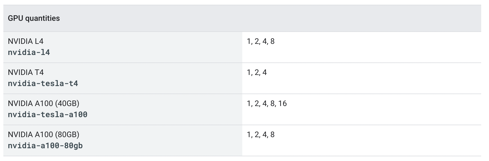

「Kubernetes で GPU を使う」と聞くと結構ハードルが高く感じる方もいらっしゃるのではないでしょうか。本記事では GKE (特に GKE Autopilot) が GPU ワークロードの実行基盤として良いよという話をします。  

# tl;dr
* GKE で GPU 使うのめっちゃ簡単
* GKE では GPU 1 枚から使えるよ
* クラスタを構築して `nodeSelector` とかで GPU Node を指定をしたマニフェストを適用するだけ (GPU デバイスドライバのインストールも不要)
```yaml
apiVersion: v1
kind: Pod
metadata:
  name: my-gpu-pod
spec:
  nodeSelector:
    cloud.google.com/gke-accelerator: nvidia-tesla-t4
  containers:
  - name: my-gpu-container
    image: nvidia/cuda:11.0.3-runtime-ubuntu20.04
    command: ["/bin/bash", "-c", "--"]
    args: ["while true; do sleep 600; done;"]
    resources:
      limits:
        nvidia.com/gpu: 1
```

# Google Kubernetes Engine (GKE)　とは
Google Kubernetes Engine（以降 GKE）は Google Cloud が提供するフルマネージドな Kubernetes プラットフォームです。  
自動スケールや自動アップグレードなど、Kubernetes をより簡単かつ安全に使うための機能を多く提供しています。GKE の良さについて以下の記事でも紹介をしているので、ご興味ある方は読んでみてください。  
https://gihyo.jp/article/2023/09/modern-app-development-on-google-cloud-02

## GKE Standard と GKE Autopilot
GKE はクラスタという単位で管理され、1 つの GKE クラスタは Control Plane と Node という 2 種類のコンポーネントから構成されます。  

Kubernetes API のエンドポイントを提供する kube-api server や Kubernetes オブジェクトの構成情報を保管する etcd などシステム関連コンポーネントが動いているマシンを Control Plane と呼びます。  
一方、実際のコンテナアプリケーションが動いているマシンを Node と呼びます。Node は Node Pool という単位でグルーピングされ管理されます。  

GKE では Control Plane は Google が管理しており、ユーザー側で Control Plane の運用（アップグレードやセキュリティ対策、スケール等）をする必要はありません。  
一方 Node については**ユーザー側で管理する GKE Standard** もしくは **Google で管理するGKE Autopilot** という 2 つのモードから選ぶことができます。  

## GKE Autopilot の特徴

# GKE Autopilot で GPU を使う

## GKE Autpilot は何をしてくれるのか？

## GKE Autopilot がサポートしている GPU の種類
GKE Autopilot では 2023.12 現在、`NVIDIA L4`, `NVIDIA T4`, `NVIDIA A100 (40 or 80GB)` の GPU をサポートしています。また、GPU は 1 枚から利用可能なので、スモールスタートが非常にしやすくなっています。  


さらに、Spot VMs という

## 試してみる

### GKE Autopilot クラスタのデプロイ
以下コマンドを実行し Autopilot クラスタをデプロイしてみます。少し時間がかかるのでゆっくり待ちます。  
```bash
# 環境変数の設定
export PROJECT_ID=<Project ID>
export CLUSTER_NAME=gpu-cluster
export REGION=asia-northeast1

# Project ID の設定
gcloud config set project ${PROJECT_ID}

# GKE Autopilot クラスタの作成
gcloud container clusters create-auto ${CLUSTER_NAME} \
    --location=${REGION}
```

### GPU を使う　Pod を試しにデプロイする

```yaml:my-gpu-pod.yaml
apiVersion: v1
kind: Pod
metadata:
  name: my-gpu-pod
spec:
  nodeSelector:
    cloud.google.com/gke-accelerator: nvidia-tesla-t4
  containers:
  - name: my-gpu-container
    image: nvidia/cuda:11.0.3-runtime-ubuntu20.04
    command: ["/bin/bash", "-c", "--"]
    args: ["while true; do sleep 600; done;"]
    resources:
      limits:
        nvidia.com/gpu: 1
```

```bash
$ kubectl apply -f my-gpu-pod.yaml

$ kubectl get pods
NAME         READY   STATUS    RESTARTS   AGE
my-gpu-pod   1/1     Running             0          5m14s

$ kubectl get nodes
NAME                                   STATUS     ROLES    AGE   VERSION
gk3-gpu-cluster-nap-75l9wfr4-25c20a8f-j49d   Ready      <none>   92s     v1.27.3-gke.100

$ kubectl describe node gk3-gpu-cluster-nap-75l9wfr4-25c20a8f-j49d
Name:               gk3-gpu-cluster-nap-75l9wfr4-25c20a8f-j49d
~~~
Labels:             addon.gke.io/node-local-dns-ds-ready=true
                    cloud.google.com/gke-accelerator=nvidia-tesla-t4
                    cloud.google.com/gke-accelerator-count=1
~~~
Capacity:
  cpu:                2
  ephemeral-storage:  98831908Ki
  hugepages-1Gi:      0
  hugepages-2Mi:      0
  memory:             7629476Ki
  nvidia.com/gpu:     1
  pods:               32
```


## DCGM Exporter を使ったモニタリング

```bash
git clone https://github.com/suffiank/dcgm-on-gke && cd dcgm-on-gke

# DCGM Exporter のインストール
kubectl create namespace gpu-monitoring-system
kubectl apply -f quickstart/dcgm_quickstart.yml

# Configure Cloud Monitoring Dashboard
gcloud monitoring dashboards create \
 --config-from-file quickstart/gke-dcgm-dashboard.yml
```

## Image Streaming
GKE Autpilot では Image Streaming が有効になっています (ver xxx 以降)
これにより、ML ワークロードなどサイズの大きいコンテナイメージの Pull を高速化することができます。
（仕組み上バックエンドに一度もってこないといけない点に注意）
試しに Image Streaming を有効化した


# まとめ
