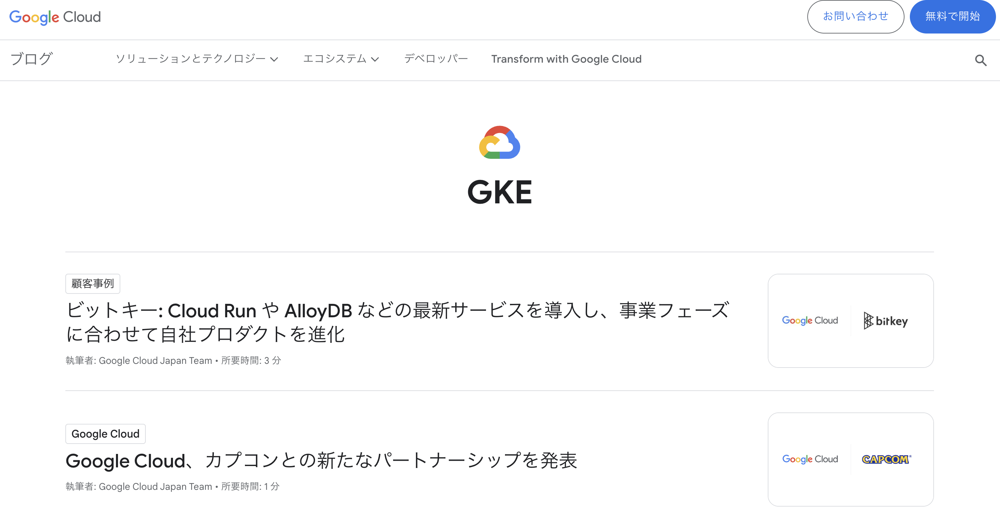

この記事は [Google Cloud Japan Advent Calendar 2023 (入門編)](https://zenn.dev/google_cloud_jp/articles/65eb509ce7dc91) の 3 日目の記事です。  

今回は [Google Cloud をゼロから学ぶならこれ! おすすめの学習リソース](https://zenn.dev/google_cloud_jp/articles/6a8a0e571841ef)という素敵記事に倣って Google Kubernetes Engine (GKE) をこれから学びたい人向けにおすすめの学習リソース (無償のもの) を紹介します。  
初学者向けのリソースだけでなく、実際のクラスタ設計にも役立つリソースを紹介します！

ちなみに、そもそも GKE って何？どういう特徴があるの？という方は以下の記事でも紹介していますので、ご興味あれば読んでみてください。  
https://gihyo.jp/article/2023/09/modern-app-development-on-google-cloud-02

# 事例から学ぶ
まずどういう企業がどういう背景や構成で GKE を使っているかを知りたい場合、事例から学ぶのが良いかもしれません。  

## Google Cloud Blog から事例を探す
GKE を実際に利用されているお客さんの事例を知りたい場合、まず確認すると良いのが Google Cloud の公式ブログです。  
とはいえブログ記事の数も多いので、特定製品 (例: GKE) に絞って記事をみたい場合は `https://cloud.google.com/blog/ja/products/gke` とアクセスしていただくのが良いと思います。  

https://cloud.google.com/blog/ja/products/gke?hl=ja

## イベントのアーカイブ動画から事例を探す
Google Cloud の公式イベントでは多くの事例が発表されました。多くのイベントでアーカイブが閲覧可能となっているため、興味のある事例などがあればぜひ確認してみてください。  
ここでは一例として、いくつかのイベントをピックアップしてご紹介します。  

### Google Cloud Day ’23 Tour
2023 年 5 ~ 6月に開催された `Google Cloud Day ’23 Tour` では 4 都市でイベントが開催され、GKE 関連の事例も多く発表されました。  
https://cloudonair.withgoogle.com/events/google-cloud-day-23

### Modern App Summit
2023 年 7 月に開催された `Modern App Summit` でも多くの事例が発表されました。  
テクニカルな話に留まらず、組織体制も含めた興味深い事例もありました。  
https://cloudonair.withgoogle.com/events/modern-app-summit-23q3

### Google Cloud Next Tokyo ’23
2023 年 12 月 3 日現在、基調講演のみアーカイブ動画が閲覧可能となっていますが、今後ブレイクアウトセッションも閲覧可能となる予定です！  
https://cloudonair.withgoogle.com/events/next-tokyo

### Innovators Live Japan 
`Innovators Live Japan` はライブ配信型のウェビナープログラムで、その中でも「サーバレス・コンテナ」というカテゴリで GKE や Cloud Run に関連した情報発信を行っています。  
お客さんの事例の話を中心に紹介しているので、興味があればこちらもご確認ください！アーカイブ閲覧可能です。  
https://cloudonair.withgoogle.com/events/innovators-live-jp?tab=serverless_containers&expand=module:serverless_containers_top

### App Modernization OnAir
事例というよりはプロダクト観点での情報発信という色が強いのですが、`App Modernization OnAir` というウェビナーのアーカイブも学習材料として有用な情報がまとまっています。  
https://cloudonair.withgoogle.com/events/solution-app-modernization

# サンプルコード・マニフェストを試す
実際の環境であれこれサンプルを動かして試したいという場合は、Google Cloud が公開しているサンプルコード、マニフェストを使ってみるのも良いかと思います。  

## 公式サンプルコード集
GKE の公式ドキュメント内で紹介されているようなサンプルコードが公開されています。  
https://cloud.google.com/kubernetes-engine/docs/samples?hl=ja

## Github 上のサンプルマニフェスト集
Github 上にもサンプルコードやマニフェストが公開されているリポジトリがあるので、私が個人的によく活用しているものをいくつか紹介します。  

### GKE Networking Recipes
GKE のネットワーク関連 (Gateway / Ingress / Service) のサンプルマニフェストが公開されています。  
気になる構成をすぐにお試しできて便利です。  
https://github.com/GoogleCloudPlatform/gke-networking-recipes

### AI/ML on GKE
AI/ML ワークロードを GKE で動かす場合のサンプル集です。スタートアップの遅延を小さくするためのプラクティスなども公開されています。  
https://github.com/GoogleCloudPlatform/ai-on-gke

# 公式のベストプラクティス ドキュメントを読み込む
公式ドキュメントでは Google Cloud としておすすめしている GKE の設定をさまざまな観点から紹介しています。  
クラスタ設計をする場合など、まずはここに書いている内容をベースに検討を始めていくのが良いのではないでしょうか。  
ちなみに（わざわざ書くまでもないことですが）ここに書いている内容が唯一解ではないので、要件的に自社に合わない場合はドキュメント内容は参考程度にしつつ他のオプションも検討していきましょう。  

## 大規模な GKE クラスタを計画する
大きい規模の GKE クラスタを設計する前にまず読んでおきたいドキュメントです。  
https://cloud.google.com/kubernetes-engine/docs/concepts/planning-scalability?hl=ja
https://cloud.google.com/kubernetes-engine/docs/concepts/planning-large-clusters?hl=ja
https://cloud.google.com/kubernetes-engine/docs/concepts/planning-large-workloads?hl=ja

また、大規模クラスタ設計の場合は GKE のリソース上限も予め確認しておきましょう。  
https://cloud.google.com/kubernetes-engine/quotas?hl=ja

## マルチテナント構成
1つの GKE クラスタ上で複数のチーム・サービスが乗ってくるようなケースで役にたつ情報がまとまっています。  
https://cloud.google.com/kubernetes-engine/docs/best-practices/enterprise-multitenancy?hl=ja

## GKE ネットワーク構成
GKE の VPC 設計、IP アドレス設計の参考に役立ちます。  
https://cloud.google.com/kubernetes-engine/docs/best-practices/networking?hl=ja

## GKE セキュリティ
セキュリティ観点での GKE の設定について情報がまとまっています。  
https://cloud.google.com/kubernetes-engine/docs/how-to/hardening-your-cluster?hl=ja

また、被る部分は多いのですが、私が昔書いた記事もよろしければ読んでみてください。  
https://medium.com/google-cloud-jp/gkesecurity-2022-1-ea4d55bcf4f7

RBAC のベストプラクティスドキュメントも存在します。  
https://cloud.google.com/kubernetes-engine/docs/best-practices/rbac?hl=ja

## コスト最適化
GKE クラスタのコスト最適化を検討されている場合、以下の記事が参考になると思います。  
https://cloud.google.com/architecture/best-practices-for-running-cost-effective-kubernetes-applications-on-gke?hl=ja

## バッチワークロード
トレーニングジョブやバッチ処理など、バッチワークロードを GKE 上で実行する際の設定が説明されています。  
https://cloud.google.com/kubernetes-engine/docs/best-practices/batch-platform-on-gke?hl=ja

# ハンズオン イベントで学ぶ
実は GKE 道場というハンズオンイベントを定期的に開催しています。コンテナや Kubernetes の基本的な話から、サービスメッシュやマルチクラスタなど高度な構成までハンズオンで学ぶことができるイベントです。  
定期的に開催のお知らせを発信していますので、もしご興味あればご参加ください！  
https://cloudonair.withgoogle.com/events/gkehandson-q4

# まとめ
GKE をこれから学びたい・詳しくなりたい方向けに、おすすめの学習リソースをご紹介しました。  
本記事で紹介したもの以外にも、リリースノートや X (旧 Twitter) による情報収集もおすすめです。 X では #gcpja というハッシュタグで日本語でのアップデート情報を流していたりするので興味があれば定期的に覗いてみてください。  
ではみなさま素敵な GKE ライフを〜  

明日は [Issei](https://zenn.dev/hoisjp) さんによる Cloud Workstations の記事です！お楽しみに！